# Atlatl Advisers

A modern financial advisory platform built with Next.js, featuring AI-powered chatbot assistance, interactive financial calculators, and comprehensive content management using Strapi. Developed as a CS 620 Capstone Project in Fall 2025, taught by [Professor Leah Ujda](https://cdis.wisc.edu/staff/ujda-leah/).

## Team Members
- [Emilia](https://github.com/ecaantero) - ecantero@wisc.edu
- [Khoa](https://github.com/khoacao2k4) - kqcao@wisc.edu
- [Kiet](https://github.com/kietphamvt) - kvpham@wisc.edu
- [Tejas](https://github.com/tejasgupta-dev) - tgupta39@wisc.edu

## Features

- **AI-Powered Chatbot**: Intelligent chatbot using Retrieval-Augmented Generation trained on Atlatl database
- **Financial Calculators**: Interactive tools for financial planning and analysis
- **Newsletter & Contact Management**: Automated signup tracking via Google Sheets API
- **Content Management**: Strapi CMS for dynamic content and resource management
- **Black Diamond Integration**: Secure authentication and login system
- **Responsive Design**: Mobile-first, modern UI built with React and Tailwind CSS

## Project Structure

This project is a monorepo containing three main applications:

```
.
├── frontend/                   # Next.js Application (Main User Interface)
├── backend/atlatl-cms/         # Strapi CMS (Headless Backend)
└── ai-sdk-rag-starter/         # Next.js Application (AI RAG Service)
```

For a detailed file structure of each application, please refer to the project directories.

## Tech Stack

### Frontend
- **Framework**: Next.js, React
- **Language**: JavaScript
- **UI Library**: Tailwind CSS
- **APIs**: Google Sheets API (newsletter/contact form logging)

### Backend
- **CMS**: Strapi (Headless CMS)
- **Authentication**: Black Diamond Login API
- **Database**: (configured via Strapi)

### AI Features
- **React + Tailwind CSS**: The layout and appearance of the chatbot
- **AI SDK**: Custom integration for financial advisory assistance
- **NeonDB**: Postgres Cloud Database integrated within Vercel for storing information embeddings. 

## Google Sheets Integration

The application automatically logs form submissions to Google Sheets:
- **Newsletter Signups**: Tracked under Newsletter tab
- **Contact Form Submissions**: Tracked under Contact tab

### Setup Google Sheets API:
1. Create a Google Cloud Project
2. Enable Google Sheets API
3. Create a Service Account
4. Download credentials JSON
5. Share your spreadsheet with the service account email
6. Add credentials to `.env.local`

## Chatbot Features

The RAG-powered chatbot provides:
- Financial advice and guidance
- Calculator assistance
- Resource recommendations
- Real-time responses using company knowledge base

## Financial Calculators

Interactive calculators for:
- Retirement planning
- Investment projections
- Mortgage calculations
- Loan amortization
- Tax estimations

## Black Diamond Integration

Black Diamond is embedded in the application as a third-party widget/iframe for client portal access.

## Content Management

Strapi CMS allows for:
- Team member profiles
- Service descriptions
- Dynamic pages' text/media content

## Architecture Diagram

```mermaid
graph TB
    subgraph "Client Layer"
        User[User/Client]
    end
    
    subgraph "Vercel - Frontend"
        NextJS[Next.js Application<br/>React Components]
        Pages[Pages & Routes]
        Calculators[Financial Calculators]
        Forms[Contact & Newsletter Forms]
        ChatUI[Chatbot Interface]
        BDEmbed[Black Diamond Embed]
    end
    
    subgraph "Backend Services"
        Strapi[Strapi CMS<br/>Strapi Cloud]
        GoogleSheets[Google Sheets API<br/>Form Data Logging]
        AIRAG[AI Chatbot Service<br/>RAG + AI SDK]
    end
    
    subgraph "Third Party"
        BlackDiamond[Black Diamond<br/>External Service]
    end
    
    subgraph "Data Storage"
        StrapiDB[(Strapi Database)]
        Sheets[(Google Sheets<br/>Newsletter Tab<br/>Contact Tab)]
        Knowledge[(Knowledge Base<br/>for RAG)]
    end
    
    User -->|HTTPS| NextJS
    NextJS --> Pages
    NextJS --> Calculators
    NextJS --> Forms
    NextJS --> ChatUI
    NextJS --> BDEmbed
    
    Pages -->|Content Requests| Strapi
    Forms -->|Log Submissions| GoogleSheets
    ChatUI -->|Chat Messages| AIRAG
    BDEmbed -.->|Embedded| BlackDiamond
    
    Strapi -->|Read/Write| StrapiDB
    GoogleSheets -->|Append Data| Sheets
    AIRAG -->|Query| Knowledge
    
    style User fill:#e1f5ff
    style NextJS fill:#0070f3
    style Strapi fill:#4945ff
    style BlackDiamond fill:#2e3440
    style GoogleSheets fill:#34a853
    style AIRAG fill:#ff6b6b
    style BDEmbed fill:#95a5a6
```



## Getting Started

### Prerequisites
- Node.js (v16 or higher)
- npm or yarn
- Black Diamond API credentials
- Google Cloud account (for Sheets API)
- Vercel Account (for frontend deployment)
- Git

### Installation

**1. Clone the repository**:
```bash
git clone https://github.com/tejasgupta-dev/Atlatl.git
cd Atlatl
```

**2. Setup Frontend**:
```bash
cd frontend
npm install
```

`.env.local` file not shared here for security reasons, but you can follow `.env.example`

**3. Setup Strapi CMS**:
```bash
cd ../backend/atlatl-cms
npm install
```

`.env.local` file not shared here for security reasons, but you can follow `.env.example`

**4. Setup AI Chatbot Service**:
```bash
cd ../../ai-sdk-rag-starter
npm install
```

Configure AI service environment variables as needed. 
Here is the standard configurations: 

_4.1. Configure the database_: 
- Go to Vercel > Storage > Create Database > Neon
- After creating Neon DB, you should have access to all environment variables (.env.local). Copy this to your own .env
_4.2. Configure the Gemini_: 
- Go to Gemini API and create an API token
- Add this to your own .env file
```
# .env
GOOGLE_GENERATIVE_AI_API_KEY=<YOUR_API_KEY>
```
_4.3. Prompt Engineering_: 
- Go to ```/frontend/src/app/api/chat```
- You will see lines of code like this
```
  const result = streamText({
    model: google("gemini-2.5-flash"),
    system: `You are a helpful assistant named Atla. If the user greets you and make small talk, reply normally. Else, do the following: 
    Check your knowledge base before answering any questions.
    Only respond to questions using information from tool calls.
    if no relevant information is found in the tool calls, respond, "Sorry, I don't know."`,
```
- You can change anything between the two backquotes ` ` to engineer the chatbot to do as you instructed.
_4.4. Adding and removing from the knowledge base_:
- To add knowledge to your database, go to ```website/admin```, login, then add the information. Information can be plain text, a docx file, or a pdf file. After pressing submit, the internal process will put this information into the knowledge base
- To remove knowledge from your database, go to Vercel, then connect to NeonDB, and manually delete it on the resource table. 

### Running the Application

#### Development Mode

**1. Start Strapi CMS** (Terminal 1):
```bash
cd backend/atlatl-cms
npm run develop
```
Access Strapi admin at `http://localhost:1337/admin`

_1.1. Configure the read token_: 

Frontend need a token from Strapi in order to be authorized to fetch the content. After booting up:

- Signup/login into admin panel
- Go to settings
- Go to API tokens section
- Create one for "Read only" access, then copy the token
- Set environment variables to `.env` in `frontend` folder:

```
# .env
STRAPI_API_TOKEN=<TOKEN_YOU_COPIED>
NEXT_PUBLIC_STRAPI_API_URL=http://localhost:1337
```

**2. Start AI Chatbot Service** (Terminal 2):
```bash
cd ai-sdk-rag-starter
npm run dev
```

**3. Start Next.js Frontend** (Terminal 3):
```bash
cd frontend
npm run dev
```
Access the website at `http://localhost:3000`

#### Production Build

```bash
# Build frontend
cd frontend
npm run build
npm start

# Build and start Strapi
cd backend/atlatl-cms
npm run build
npm start
```

## Deployment

### Frontend (Vercel)
The Next.js frontend is deployed on Vercel. You can connect your GitHub repository to Vercel for automatic deployments on push.

**Vercel Environment Variables:**
- Add all `NEXT_PUBLIC_*` variables
- Configure Google Sheets API credentials
- Set Strapi backend URL (production)

### Backend (Strapi Cloud)
The Strapi CMS is deployed on Strapi Cloud:

1. Connect your GitHub repository to Strapi Cloud
2. Configure environment variables in Strapi Cloud dashboard
3. Deploy automatically on push to main branch
4. To connect to the frontend, please do the same step (copying token step) above, and set the environement variables in Vercel project settings:

```
# .env
STRAPI_API_TOKEN=<TOKEN_YOU_COPIED>
NEXT_PUBLIC_STRAPI_API_URL=<LINK_TO_ADMIN_PANEL>
```

Please note the link to admin panel should be public one, e.g (`https://accessible-life-xxxxxxxxxxxxx.strapiapp.com`)


### Environment Variables
Ensure all production environment variables are configured in:
- **Vercel Dashboard** for frontend and the chatbot
- **Strapi Cloud Dashboard** for CMS backend

## How the Code Works

### Application Architecture

The application follows a modern JAMstack architecture with three main layers:

#### 1. Frontend Layer (Next.js)

**Routing & Pages**: Uses Next.js App Router for file-based routing. Each page component in `src/app/` corresponds to a URL route.

**Component Structure**:
- **Page Components**: Top-level route handlers that fetch data and render layouts
- **Reusable Components**: Modular UI pieces in `src/components/` organized by feature
- **Layout System**: Shared layout wrapper (`layout.js`) provides consistent navigation and footer across all pages

**Data Fetching Flow**:
```javascript
// Example: Team page fetches from Strapi
Page Component → lib/strapi.js → Strapi API → Transform Data → Render
```

**Key Patterns**:
- Server Components for SEO and performance (default in Next.js 13+)
- Client Components (marked with `'use client'`) for interactive features
- API routes in `src/app/api/` handle server-side logic

#### 2. Content Management (Strapi)

**Content Types**: Strapi defines structured content models for:
- Homepage sections
- Team members with dynamic routing
- Service descriptions
- Blog posts and resources
- FAQ entries

**API Integration**: Frontend uses `lib/strapi.js` wrapper to:
- Fetch content via REST API
- Handle authentication tokens
- Transform responses for React components
- Cache content for performance

#### 3. AI Chatbot System

**RAG Pipeline**:
```
User Query → Embedding Generation → Vector Search → Context Retrieval → LLM Response
```

**Components**:
- `embedding.ts`: Generates vector embeddings from text
- Database with vector storage for knowledge base can be viewed and edit on Vercel.
- API route (`api/chat/route.ts`) orchestrates the RAG process
- Chatbot UI component manages conversation state

**How it works**:
1. User sends message through chatbot interface
2. Message is embedded into vector representation
3. Semantic search finds relevant company knowledge
4. Retrieved context + user query sent to LLM
5. AI generates response based on company information
6. Response streams back to user interface

#### 4. Financial Calculators

**Architecture**:
- `CalculatorBase.jsx`: Reusable wrapper providing consistent UI/UX
- Individual calculator configs define inputs, calculations, and outputs
- `AutoChart.jsx`: Dynamically generates visualizations based on calculation results
- `EmailGateOverlay.jsx`: Captures leads before showing detailed results

**Calculator Flow**:
```
User Input → Validation → Calculation Logic → Results Display → Chart Generation
```

#### 5. Form Handling & Google Sheets Integration

**Process**:
1. User submits contact form or newsletter signup
2. Frontend validates input
3. Data sent to Google Sheets API via service account
4. Response confirms successful logging
5. User receives confirmation message

**Implementation**:
- `google-sheets/actions.js`: Server-side API calls to Google Sheets
- Service account authentication for secure access
- Separate tabs for different form types

### Database & State Management

**Strapi Database**: Stores all CMS content with relationships between content types

**Local Database**: Used for RAG knowledge base with vector embeddings

**Client State**: React hooks manage UI state, form inputs, and calculator values

**No Global State Management**: Simple prop drilling sufficient for application size

## What Works

### Fully Functional Features

**1. Content Management System**
- Strapi CMS fully operational with custom content types
- Dynamic page generation from CMS content
- Image uploads and media management
- Multi-user admin access with role-based permissions

**2. Core Website Pages**
- Homepage with hero, services carousel, and team showcase
- About Us page with company history and values
- Services page with tabbed navigation and detailed descriptions
- Why Atlatl page with video embedding and value propositions
- Process page with interactive roadmap visualization
- Team directory with individual member detail pages
- Resources section with blog posts and filtering
- FAQ page with accordion-style Q&A

**3. Financial Calculators**
- Multiple working calculators (retirement, mortgage, investment, etc.)
- Real-time calculations with instant updates
- Interactive charts using chart libraries
- Email gate system capturing leads before full access
- Responsive design working on mobile and desktop
- Input validation and error handling

**4. AI Chatbot**
- RAG-based conversational interface
- Context-aware responses using company knowledge base
- Message history within session
- Streaming responses for better UX
- Fallback handling for off-topic queries

**5. Form Systems**
- Contact form with validation
- Newsletter signup functionality
- Google Sheets integration logging all submissions
- Success/error state handling
- Email validation and sanitization

**6. Navigation & UI**
- Responsive navbar with dropdown menus
- Mobile hamburger menu
- Footer with sitemap and social links
- Smooth scrolling and transitions
- Consistent branding and design system

**7. Deployment Infrastructure**
- Vercel deployment for frontend (automatic from GitHub)
- Strapi Cloud for CMS backend
- Environment variable management
- HTTPS and custom domain support

## Known Issues & Limitations

**1. AI Chatbot Limitations**
- Knowledge base may need regular updates as company information changes
- No conversation persistence across sessions
- Limited handling of complex multi-turn conversations

**2. Calculator Issues**
- No ability to save or share calculation results
- Email gate can be bypassed with browser dev tools

**3. Performance Concerns**
- Large images from Strapi not optimized automatically
- No image CDN for faster delivery
- Initial page load can be slow due to CMS data fetching

**4. Admin Features**
- No built-in analytics dashboard
- Email submissions only viewable in Google Sheets
- No way to respond to contact forms from admin panel

## Future Development Priorities

**1. Chatbot Improvements**
- Add conversation history persistence with database storage
- Build admin interface for updating knowledge base
- Implement user feedback mechanism (thumbs up/down)
- Add suggested questions/prompts feature
- Support file upload for document analysis
- Multi-language support for international clients

**3. Calculator Enhancements**
- Save calculation scenarios with user accounts
- Share calculation results via unique URLs
- Export results to PDF reports
- Add comparison mode for side-by-side scenarios
- Create calculator recommendation engine

**4. Analytics & Insights**
- Admin dashboard showing:
  - Website traffic and user behavior
  - Most popular calculators and resources
  - Form submission analytics
  - Chatbot conversation metrics
- Integration with Google Analytics 4
- Heatmap tracking for UX improvements
- A/B testing framework

**5. Community Features**
- Client forum or discussion board
- Webinar hosting and replay library
- Live Q&A sessions
- Peer-to-peer client networking
- Financial education courses
- Gamification for financial literacy

## License

This project is part of the University of Wisconsin - Madison Capstone Program for CS 620.

## Contact

For questions or inquiries about Atlatl Advisers, please use the contact form on our website.
