# Atlatl Advisers

A modern financial advisory platform built with Next.js, featuring AI-powered chatbot assistance, interactive financial calculators, and comprehensive content management using strapi. Developed as a CS 620 Capstone Project in Fall 2025, taught by Professor Leah Ujda.

## Team Members
- [Emilia ](https://github.com/ecaantero)
- [Khoa](https://github.com/khoacao2k4)
- [Kiet](https://github.com/kietphamvt)
- [Tejas](https://github.com/tejasgupta-dev)

## 🚀 Features

- **AI-Powered Chatbot**: Intelligent chatbot using RAG (Retrieval-Augmented Generation) trained on Atlatl database
- **Financial Calculators**: Interactive tools for financial planning and analysis
- **Newsletter & Contact Management**: Automated signup tracking via Google Sheets API
- **Content Management**: Strapi CMS for dynamic content and resource management
- **Black Diamond Integration**: Secure authentication and login system
- **Responsive Design**: Mobile-first, modern UI built with React and Tailwind CSS

## 📁 Project Structure

```
Atlatl/
├── frontend/                      # Next.js App
│   ├── src/
│   │   ├── app/                   # App Router pages & routes
│   │   │   ├── layout.js
│   │   │   ├── page.jsx
│   │   │   ├── globals.css
│   │   │   ├── favicon.ico
│   │   │   ├── not-found.jsx
│   │   │   ├── about-us/page.jsx
│   │   │   ├── services/page.jsx
│   │   │   ├── why-atlatl/
│   │   │   │   ├── page.jsx
│   │   │   │   ├── HeroSection.jsx
│   │   │   │   ├── VideoSection.jsx
│   │   │   │   ├── InfoGrid.jsx
│   │   │   │   ├── PurposeSection.jsx
│   │   │   │   ├── CommitmentSection.jsx
│   │   │   │   └── CallToActionBanner.jsx
│   │   │   ├── process/page.jsx
│   │   │   ├── team/
│   │   │   │   ├── page.jsx
│   │   │   │   └── [slug]/page.jsx
│   │   │   ├── resources/
│   │   │   │   ├── page.jsx
│   │   │   │   ├── faq/page.jsx
│   │   │   ├── calculators/page.jsx
│   │   │   ├── contact-us/page.jsx
│   │   │   ├── client-experience/page.jsx
│   │   │   ├── log-in/page.jsx
│   │   │   ├── admin/page.jsx
│   │   │   ├── maintenance/page.jsx
│   │   │   └── api/
│   │   │       ├── chat/route.ts
│   │   │       ├── upload/route.ts
│   │   │       └── admin-login/route.ts
│   │   ├── components/
│   │   │   ├── Navbar.jsx
│   │   │   ├── NavDropdown.jsx
│   │   │   ├── Footer.jsx
│   │   │   ├── Markdown.jsx
│   │   │   ├── AccordionItem.jsx
│   │   │   ├── homepage/
│   │   │   │   ├── Hero.jsx
│   │   │   │   ├── AboutUs.jsx
│   │   │   │   ├── ServiceCarousel.jsx
│   │   │   │   ├── ProcessTable.jsx
│   │   │   │   ├── HomeTeam.jsx
│   │   │   │   └── CtaSection.jsx
│   │   │   ├── chatbot/Chatbot.jsx
│   │   │   ├── contact/ContactForm.jsx
│   │   │   ├── calculators/
│   │   │   │   ├── CalculatorBase.jsx
│   │   │   │   ├── EmailGateOverlay.jsx
│   │   │   │   ├── InputComponents.jsx
│   │   │   │   ├── AutoChart.jsx
│   │   │   │   ├── utils.js
│   │   │   │   └── configs/
│   │   │   │       └── ...multiple calculator configs...
│   │   │   ├── service/
│   │   │   │   ├── TabContent.jsx
│   │   │   │   └── FaqSection.jsx
│   │   │   ├── resource/
│   │   │   │   ├── PostsSection.jsx
│   │   │   │   └── Post.jsx
│   │   │   └── process/
│   │   │       ├── RoadMap.jsx
│   │   │       ├── RoadmapShort.jsx
│   │   │       ├── RoadmapSection.jsx
│   │   │       ├── RoadmapShortSection.jsx
│   │   │       ├── RoadmapTextSection.jsx
│   │   │       ├── RoadmapImageSection.jsx
│   │   │       └── RoadmapConnector.jsx
│   │   ├── lib/
│   │   │   ├── utils.ts
│   │   │   ├── strapi.js
│   │   │   ├── constant.js
│   │   │   ├── helper.js
│   │   │   ├── env.mjs
│   │   │   ├── google-sheets/
│   │   │   │   ├── actions.js
│   │   │   │   └── useGoogleSheetsLogger.js
│   │   │   ├── ai/embedding.ts
│   │   │   ├── actions/resources.ts
│   │   │   └── db/
│   │   │       ├── index.ts
│   │   │       ├── migrate.ts
│   │   │       ├── schema/
│   │   │       └── migrations/
│   ├── public/                     # Static assets
│   │   ├── images/
│   │   └── fonts/
│   ├── package.json
│   ├── next.config.mjs
│   └── README.md
│
├── backend/atlatl-cms/             # Strapi Backend
│   ├── src/
│   │   ├── index.ts
│   │   ├── api/
│   │   │   ├── homepage/
│   │   │   ├── servicepage/
│   │   │   ├── whyatlatlpage/
│   │   │   ├── processpage/
│   │   │   ├── team-member/
│   │   │   └── ...more content-types...
│   │   ├── components/
│   │   ├── middlewares/
│   │   ├── extensions/
│   │   └── admin/
│   ├── config/
│   ├── public/
│   ├── package.json
│   └── README.md

```

## Tech Stack

### Frontend
- **Framework**: Next.js, React
- **Language**: JavaScript
- **UI Library**: Tailwind CSS
- **APIs**: Google Sheets API (newsletter/contact form logging)

### Backend
- **CMS**: Strapi (Headless CMS)
- **Authentication**: Black Diamond Login API
- **Database**: (configured via Strapi)

### AI Features
- **Chatbot**: RAG-based conversational AI
- **AI SDK**: Custom integration for financial advisory assistance

## 🏁 Getting Started

### Prerequisites
- Node.js (v16 or higher)
- npm or yarn
- Google Cloud account (for Sheets API)
- Black Diamond API credentials
- Git

### Installation

1. **Clone the repository**:
```bash
git clone https://github.com/tejasgupta-dev/Atlatl.git
cd Atlatl
```

2. **Setup Frontend**:
```bash
cd frontend
npm install
```

`.env.local` file not shared here for security reasons

3. **Setup Strapi CMS**:
```bash
cd ../backend/atlatl-cms
npm install
```

`.env.local` file not shared here for security reasons

4. **Setup AI Chatbot Service**:
```bash
cd ../../ai-sdk-rag-starter
npm install
```

Configure AI service environment variables as needed.

### Running the Application

#### Development Mode

1. **Start Strapi CMS** (Terminal 1):
```bash
cd backend/atlatl-cms
npm run develop
```
Access Strapi admin at `http://localhost:1337/admin`

2. **Start AI Chatbot Service** (Terminal 2):
```bash
cd ai-sdk-rag-starter
npm run dev
```

3. **Start Next.js Frontend** (Terminal 3):
```bash
cd frontend
npm run dev
```
Access the website at `http://localhost:3000`

#### Production Build

```bash
# Build frontend
cd frontend
npm run build
npm start

# Build and start Strapi
cd backend/atlatl-cms
npm run build
npm start
```

## 📊 Google Sheets Integration

The application automatically logs form submissions to Google Sheets:
- **Newsletter Signups**: Tracked under Newsletter tab
- **Contact Form Submissions**: Tracked under Contact tab

### Setup Google Sheets API:
1. Create a Google Cloud Project
2. Enable Google Sheets API
3. Create a Service Account
4. Download credentials JSON
5. Share your spreadsheet with the service account email
6. Add credentials to `.env.local`

## 💬 Chatbot Features

The RAG-powered chatbot provides:
- Financial advice and guidance
- Calculator assistance
- Resource recommendations
- Real-time responses using company knowledge base

## 🧮 Financial Calculators

Interactive calculators for:
- Retirement planning
- Investment projections
- Mortgage calculations
- Loan amortization
- Tax estimations

## 🔐 Black Diamond Integration

Black Diamond is embedded in the application as a third-party widget/iframe for client portal access.

## 📝 Content Management

Strapi CMS allows for:
- Blog post creation and management
- Resource library updates
- Team member profiles
- Service descriptions
- Dynamic page content

## 🏗 Architecture

```mermaid
graph TB
    subgraph "Client Layer"
        User[👤 User/Client]
    end
    
    subgraph "Vercel - Frontend"
        NextJS[Next.js Application<br/>React Components]
        Pages[Pages & Routes]
        Calculators[Financial Calculators]
        Forms[Contact & Newsletter Forms]
        ChatUI[Chatbot Interface]
        BDEmbed[Black Diamond Embed]
    end
    
    subgraph "Backend Services"
        Strapi[Strapi CMS<br/>Strapi Cloud]
        GoogleSheets[Google Sheets API<br/>Form Data Logging]
        AIRAG[AI Chatbot Service<br/>RAG + AI SDK]
    end
    
    subgraph "Third Party"
        BlackDiamond[Black Diamond<br/>External Service]
    end
    
    subgraph "Data Storage"
        StrapiDB[(Strapi Database)]
        Sheets[(Google Sheets<br/>Newsletter Tab<br/>Contact Tab)]
        Knowledge[(Knowledge Base<br/>for RAG)]
    end
    
    User -->|HTTPS| NextJS
    NextJS --> Pages
    NextJS --> Calculators
    NextJS --> Forms
    NextJS --> ChatUI
    NextJS --> BDEmbed
    
    Pages -->|Content Requests| Strapi
    Forms -->|Log Submissions| GoogleSheets
    ChatUI -->|Chat Messages| AIRAG
    BDEmbed -.->|Embedded| BlackDiamond
    
    Strapi -->|Read/Write| StrapiDB
    GoogleSheets -->|Append Data| Sheets
    AIRAG -->|Query| Knowledge
    AIRAG -->|Fetch Context| Strapi
    
    style User fill:#e1f5ff
    style NextJS fill:#0070f3
    style Strapi fill:#4945ff
    style BlackDiamond fill:#2e3440
    style GoogleSheets fill:#34a853
    style AIRAG fill:#ff6b6b
    style BDEmbed fill:#95a5a6
```



## 🚀 Deployment

### Frontend (Vercel)
The Next.js frontend is deployed on Vercel:

```bash
cd frontend
vercel --prod
```

Or connect your GitHub repository to Vercel for automatic deployments on push.

**Vercel Environment Variables:**
- Add all `NEXT_PUBLIC_*` variables
- Configure Google Sheets API credentials
- Set Strapi backend URL (production)

### Backend (Strapi Cloud)
The Strapi CMS is deployed on Strapi Cloud:

1. Connect your GitHub repository to Strapi Cloud
2. Configure environment variables in Strapi Cloud dashboard
3. Deploy automatically on push to main branch

**Strapi Cloud Environment Variables:**
- Database configuration
- API keys and secrets
- CORS settings for Vercel frontend domain

### Environment Variables
Ensure all production environment variables are configured in:
- **Vercel Dashboard** for frontend
- **Strapi Cloud Dashboard** for CMS backend

## 📄 License

This project is part of a university capstone program for CS 620.

## 📧 Contact

For questions or inquiries about Atlatl Advisers, please use the contact form on our website.
